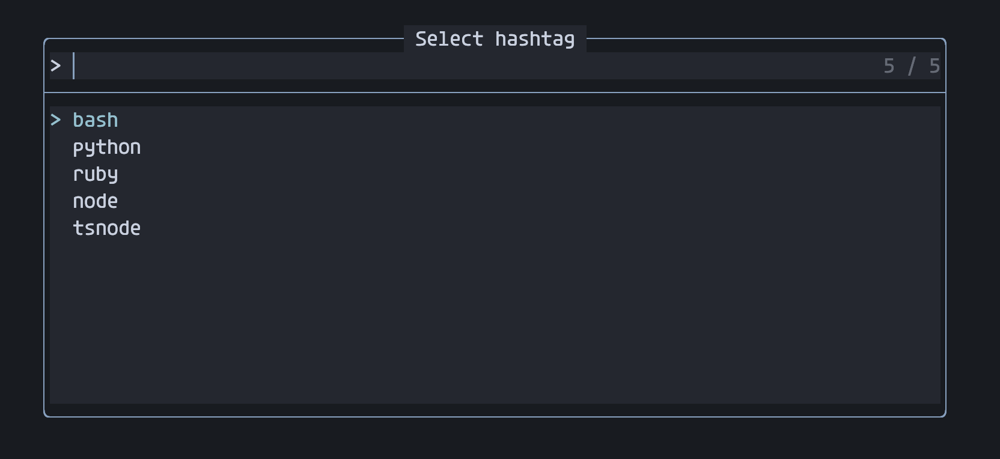

# Stuff.nvim 📦

Collection of Neovim micro-plugins

## Installation

See [stuff.lua](https://github.com/elentok/dotfiles/blob/main/core/lazyvim/lua/plugins/stuff.lua)

## Toggle Word ↔

Toggles boolean values (by pressing `<Leader>tw` in normal mode):

- true &harr; false
- on &harr; off
- enabled &harr; disabled
- left &harr; right
- top &harr; bottom
- margin-left &harr; margin-right
- etc...

## Open Link 🔗

Open links in a browser (or copy to clipboard when in an SSH session).

The reason I wrote this plugin is that I wanted to be able to open Jira ticket
IDs and Github pull requests from my notes (or code comments) without writing
the entire URL.

For example, pressing `gx` while standing on MYJIRAPROJ-1234 will open the
ticket in the browser. See example below.

## Paste Image 🖼️

You can use the `:PasteImage` command to paste an image from the clipboard to a
file and add a markdown link to that image (``).

## Git

- `<leader>ga` - runs `git add -p`
- `<leader>gu` - runs `git checkout -p`
- `<leader>gw` - writes and stages the current file
- `<leader>gr` - resets all changes to the current file (with confirmation)
- `<leader>gy` - yank the current file's public URL
- `<leader>go` - open the current file's public URL

## Notes 🗒️

- `<leader>jw` - Jump to the weekly note
- `<c-x>t` (insert mode) - adds a new task (`- [ ]`)

## Alternate file 📂

Use `<leader>jo` to jump between the code and the test file.

## Scriptify 📜

Use `<leader>sf` to add a shebang line and make the file executable.

## Log Line 🔍

Use `<c-l>` (in insert mode) to a add log line (`console.log`, `put()`, `echo`)
